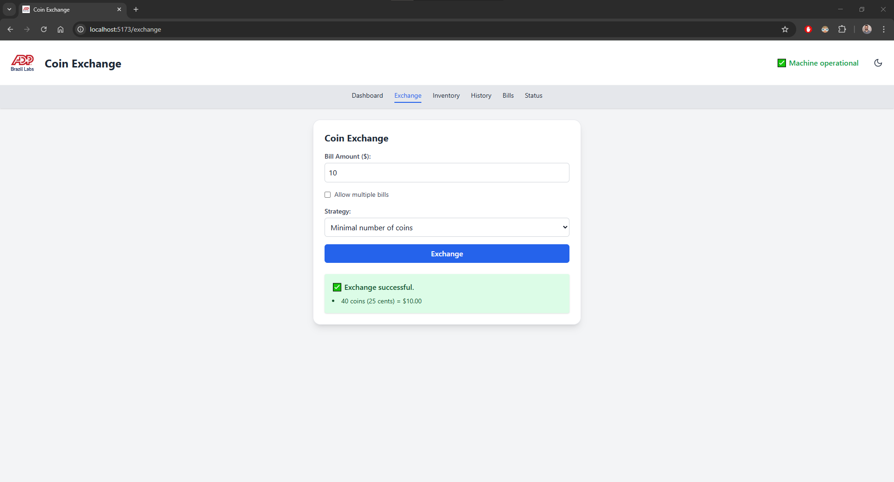
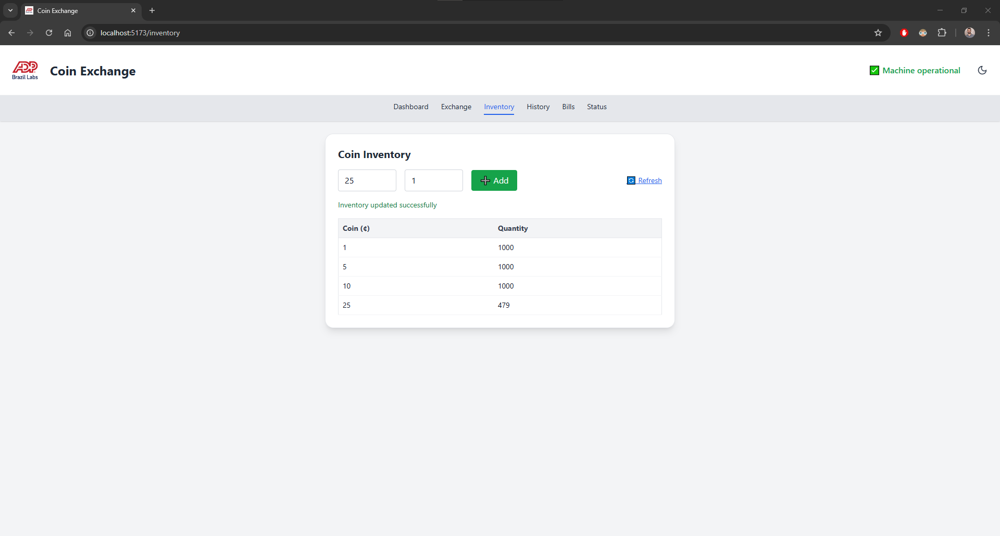

# Coin Exchange

Sistema fullstack para troca de cédulas por moedas. Desenvolvido como parte do desafio técnico da ADP Brasil Labs.

---

## Estrutura do Projeto

```
coinExchange/
│
├── src/               # Backend (Spring Boot)
├── frontend/          # Frontend (React + Vite + Tailwind CSS)
├── pom.xml
└── README.md
```

---

## Como Executar

### Pré-requisitos
- Java 17+
- Node.js 18+
- Maven 3.8+

### Backend (porta 8080)
```bash
./mvnw spring-boot:run
```
Ou via IDE: rode a classe `CoinExchangeApplication.java`

### Frontend (porta 5173)
```bash
cd frontend
npm install
npm run dev
```

Acesse: [http://localhost:5173](http://localhost:5173)

---

## Acesso de Teste

- **Usuário:** `klinton`
- **Senha:** `klinton123`

---

## Funcionalidades

### Lógica Principal
- Troca de cédulas por moedas com estratégia mínima ou máxima
- Suporte a cédulas únicas ou múltiplas

### Backend (Spring Boot)
- API RESTful segura com autenticação básica
- Estratégias de troca de moedas com estoque limitado
- Validações e tratamento de exceções
- Filtros por data, valor e estratégia
- Armazenamento em banco de dados (via JPA/H2 ou outro)

### Frontend (React + Vite + Tailwind CSS)
- Interface moderna, responsiva e com tema escuro
- Troca de moedas com feedback de sucesso ou erro
- Histórico com filtros
- Inventário com possibilidade de adicionar moedas
- Visão de cédulas recebidas
- Status da máquina
- Dashboard com resumo geral

---

## ️Prints de Telas

### Dashboard


### Trocar Moedas


### Histórico de Transações


### Inventário de Moedas


### Cédulas Recebidas


### Status da máquina


---

## Considerações Finais

- Projeto organizado para facilitar a leitura e execução
- Separação clara entre frontend e backend
- Autenticação básica integrada ao sistema
- README e repositório preparados para avaliação

---

> Desenvolvido por [klintondaltio](https://github.com/klintondaltio) com dedicação.
